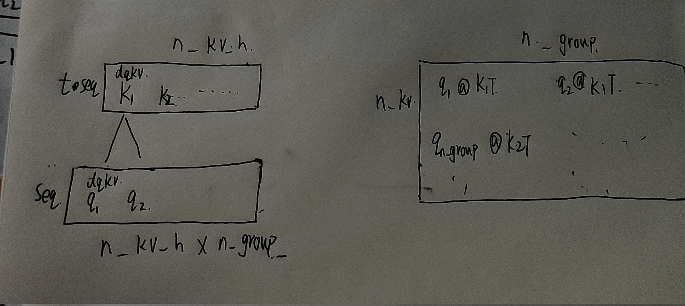
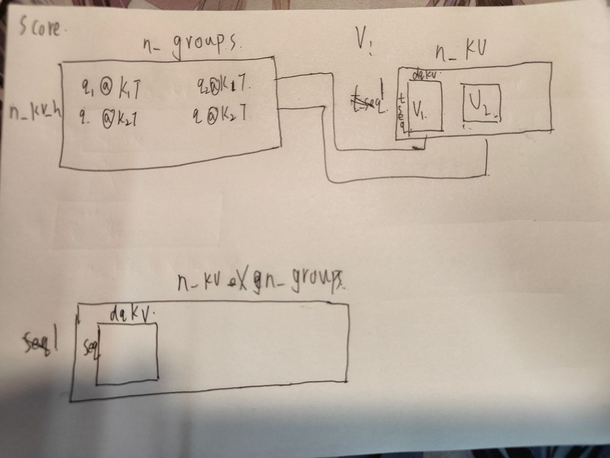
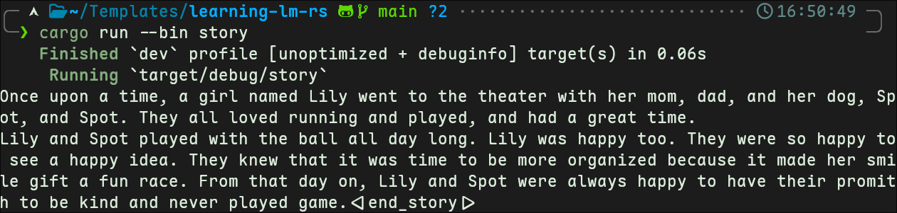
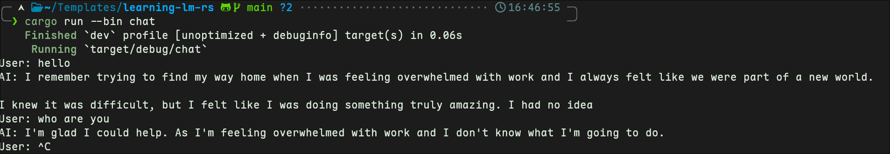
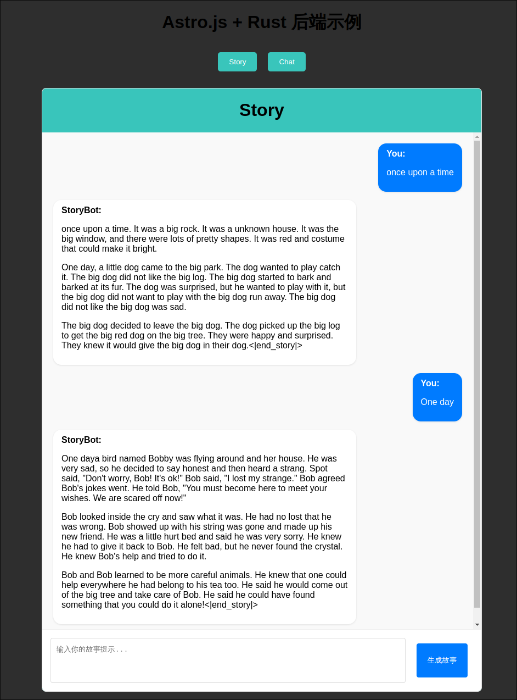
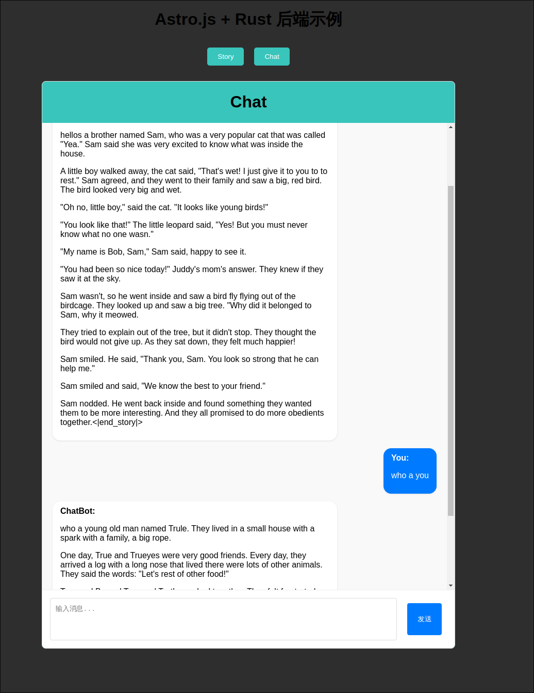

# 项目报告

## 作业阶段
这个阶段的难点只有模型参数加载，在解决这个问题时，首先是打印出了模型的tensor名，
后面发现了$TensorView.data()$函数，知道了数据在底层是u8类型保存的，也就是我们要把一个字节大小的
u8类型转化成我们需要的类型, 后续通过查阅资料发现了$chunks_exact， from_le_bytes$函数，
第一个函数用来把[u8]类型分割成4个一组（或者两个一组），再通过from_le_bytes函数将4个u8类型的数据转化成f32
这两个函数的签名如下
```

    pub fn chunks_exact(&self, chunk_size: usize) -> ChunksExact<'_, T> 

    pub const fn from_le_bytes(bytes: [u8; 4]) -> Self 

```

## 项目阶段

对于老师所给的完整的Self-Attention层的计算，大部分已经完成了。
我们所需要完成的是
```
score = Q @ K.T / sqrt(dim)
attn = softmax(score)
attn_V = attn @ V
out = attn_V @ O_weight.T
residual = out + residual
```
其中后两行实际上就是作业阶段的矩阵乘算子。前三行公式中，softmax老师已经完成了。
实际上只需要完成两个矩阵乘。这里核心的问题是Q，K的形状不一样，atten和V的形状也不一样
### Q@K
其中Q，K的形状以及他们的乘积score的形状如下
```
    q: &Tensor<T>,                 // (seq, n_kv_h * n_groups * dqkv)
    k: &Tensor<T>,                 // (total_seq, n_kv_h * dqkv)

    att_scores: &mut Tensor<T>,    // (n_kv_h, n_groups, seq, total_seq)

```
通过查阅资料和对老师给的张量形状做比较。我绘制了如下图

也就是说，  
```
Q     :是大小为(seq   ,n_kv_h*n_groups)大小的矩阵，他的每一个元素是(seq      ,dqkv     )大小的矩阵  
K     :是大小为(seq   ,n_kv_h         )大小的矩阵，他的每一个元素是(total_seq,dqkv     )大小的矩阵  

Score :是大小为(n_kv_h,n_groups       )大小的矩阵，他的每一个元素是(seq      ,total_seq)大小的矩阵  

```
我们做的是前把前n_groups个q与第一个k做标准矩阵成，他们依次的构成Scores的第一行元素，每一个元素是(seq,total_seq)大小的矩阵
重复这个操作n_kv_h次，就有了n_kv_h行。

### Score@V 

Q@K后我们得到了score，我们会对他进行softmax操作，这个操作不会改变张量的形状  
对于这个乘法，我绘制了这个图


```
Score        :是大小为(n_kv_h,n_groups       )大小的矩阵，他的每一个元素是(seq      ,total_seq)大小的矩阵  
V            :是大小为(1     ,n_kv_h*n_groups)大小的矩阵，他的每一个元素是(total_seq,dqkv     )大小的矩阵  

hiddden_satte:是大小为(1     ,n_kv_h*n_groups)大小的矩阵，他的每一个元素是(seq      ,dqkv     )大小的矩阵  
```
第一行的socre与第一个v做标准矩阵乘，他们的结果是第一个hidden_state的前n_groups个元素

### 文本生成

在genertate函数中,通过我们补全的Self-Attetion层，计算出可能的结果，再通过random_sample函数，对概率最大为top_k个的词，
对概率和为top_p个的词 随机取样。只要重复这个过程，直到到达我们预设的文本上限或者模型的eos_token_id值就停止。


### Chat对话

在对话中我了解到了模型的tie_word_embeddings参数，这个参数会控制模型的embedding_table张量和lm_head张量是否共用一个值.  
在这里，我给老师的generate函数增加了一个cache参数，目的是能再Chat中保存cache，节约计算资源。



## 评优目标

我完成了以下两个目标

### 混合精度推理

这个目标是通过引入rust的num-traits和half库，前者提供了Float trait，后者提供了f16和bf16类型。
在完成这个目标时，有两点需要完成，一者是给所有的算子和部分自定义类型改造成泛型函数和泛型类型，
比如说一下函数的签名和类型的签名
```
impl<T: Copy + Default + Float + MulAssign + Sum + AddAssign + DivAssign + params::FromBytes> Llama<T>
impl<T: Copy + Default + Clone + FromBytes> LLamaParams<T> 

pub fn rope<T: Copy + Default + Float>(y: &mut Tensor<T>, start_pos: usize, theta: f32) 
pub fn masked_softmax<T: Copy + Default + DivAssign + Sum + Float>(y: &mut Tensor<T>) 
```

其中可以看到为Llama类型和LLamaParams类型实现泛型时引入了FromBytes trait，
这是另一个需要完成的点，我们要能加载混合精度，就需要从u8转化成我们需要的类型，
这个trait就能保证我们的类型能安全的实现我们的转化,我们给这些类型（f32,f16,bf16)实现这个trait，
```
pub trait FromBytes: Sized {
    fn from_bytes(bytes: &[u8]) -> Vec<Self>;
}
```
就可以读取我们需要的f16和bf16精度模型

### 可交互的 UI 或网络服务 API
为了完成这个，我们前端选择Astro.js+react,后端则是rust以及axum等库。
```
前端仓库运行：
npm install 
npm run dev

后端仓库运行:
cargo run --bin backend
```

#### 难点 

这里的难点在于chat模型，我们应该在后端只加载一次模型、token。我通过OnceCell完成对他们的处理  
具体来说模型加载和token，通过OnceCell嵌套我的类型，get_or_init()函数来初始化或者借用。  
```
static MODEL: OnceCell<model::Llama<f32>> = OnceCell::new();
static TOKENIZER: OnceCell<Tokenizer> = OnceCell::new();

```
我通过这样的处理让他们能够只初始化一次,在多论的请求中不会多次初始化


#### 效果如下





